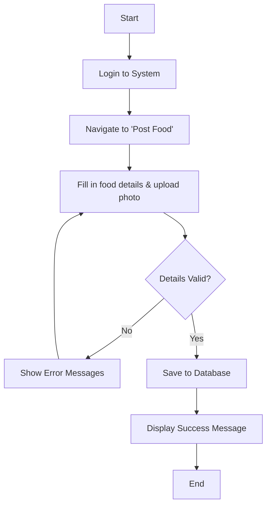
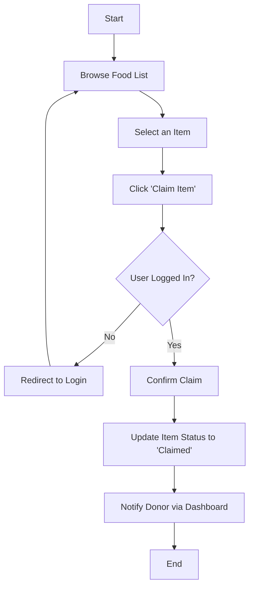
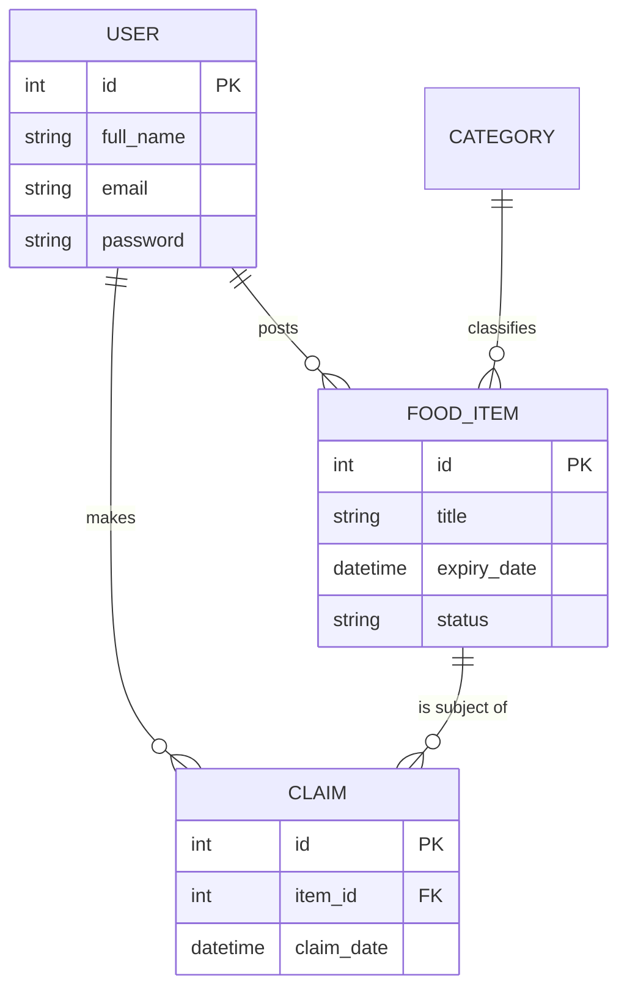
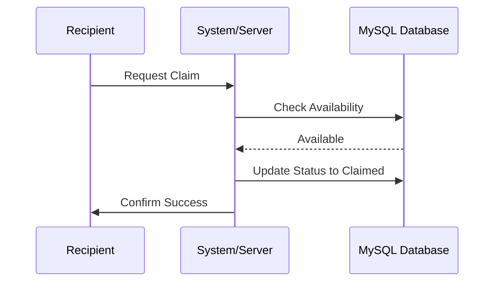
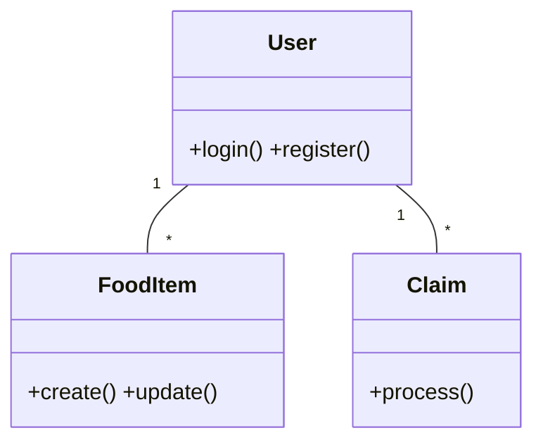

# Sprint 2 Deliverables – FoodShare Green Tech

## 1. Project Information
**Group Name:** FoodShare Green Tech Team
**Project Title:** FoodShare – Community Food Waste Reduction Platform
**GitHub Repository:** [FoodShare-GreenTech](https://github.com/Sameercdytharoo/FoodShare-GreenTech)
**Task Board:** [GitHub Project Board](https://github.com/users/maheshbatala/projects/1)

### Team Members & Roles
1. **Sameer Chaudhary Tharu** (Lead Developer / Scrum Master)
2. **Mahesh Batala** (Frontend Developer)
3. **Dhiraj Yadav** (Backend Developer)
4. **Prativa Rai** (Database Administrator / Tester)
5. **Rupesh Shah** (DevOps / Documentation Lead)

---

## 2. Refined Project Idea Summary
**"Sharing, exchange and building community"**

FoodShare is a dynamic, database-driven web application designed to combat food waste and address the cost-of-living crisis within local communities. Unlike commercial delivery apps, FoodShare focuses on **co-operative exchange** for mutual benefit rather than financial gain. 

The platform allows individuals, households, and local businesses to list surplus, edible food that would otherwise go to waste. Community members can browse these listings, claim items, and arrange for collection. By facilitating the redistribution of excess food, the project supports climate change mitigation by reducing landfill waste and fosters a supportive local network.

---

## 3. Requirements Model - Use Case Diagram
The following diagram illustrates the primary interactions between our system actors and the core functionalities as defined for the MVP.

```mermaid
usecaseDiagram
    actor "Donor" as D
    actor "Recipient" as R
    actor "Guest" as G

    package "FoodShare System" {
        usecase "Register/Login" as UC1
        usecase "List surplus food" as UC2
        usecase "Browse food items" as UC3
        usecase "Filter by category" as UC4
        usecase "Claim food item" as UC5
        usecase "Manage personal listings" as UC6
    }

    G --> UC1
    G --> UC3
    D --> UC1
    D --> UC2
    D --> UC6
    R --> UC1
    R --> UC3
    R --> UC4
    R --> UC5
```

---

## 4. Sprint 3 Specification (Requirements & Design)
This section contains the detailed specifications required to begin full-stack development in Sprint 3.

### 4.1 User Stories (Prioritized)

| ID | User Story | Priority | Acceptance Criteria |
|:---|:---|:---|:---|
| US1 | **As a Donor**, I want to list surplus food items with details so that they can be discovered. | High | - Form validation for required fields.<br>- Success message after submission. |
| US2 | **As a Recipient**, I want to browse available food items so that I can find food near me. | High | - Display items with titles and distances.<br>- Filter items by category (e.g., Bakery). |
| US3 | **As a User**, I want to register and log in securely so that my history is tracked. | High | - Secure password hashing.<br>- Session management with Express-session. |
| US4 | **As a Recipient**, I want to claim a food item so that it is no longer available. | Medium | - "Claim" button updates item status in DB. |
| US5 | **As a Donor**, I want to see a dashboard of my listings so that I can manage them. | Medium | - View, Edit, and Delete options for own listings. |

### 4.2 Wireframes (Core Screens)
These low-fidelity wireframes serve as the blueprint for our Sprint 3 development.

#### Home Page / Browse View
 

#### Add Donation Form


### 4.3 Activity Diagrams

#### Visual Donation Process


#### Technical Workflow (Mermaid)

#### Listing a Food Item (Donor Workflow)


#### Claiming a Food Item (Recipient Workflow)


---

## 5. Technical Specifications (Other Artefacts)

### 5.1 ERD (Entity Relationship Diagram)

#### Visual Schema Overview


#### Technical Schema (Mermaid)


### 5.2 Sequence Diagram (Claiming Process)


### 5.3 Class Diagram (Backend Structure)


---

## 6. Ethical, Security & Usability Considerations

### Ethical Considerations
- **Food Safety:** Mandatory checkbox for donors to confirm correct storage temperatures.
- **Inclusivity:** WCAG AA contrast standards (Forest Green on Light Mint).
- **Privacy:** Phone numbers masked until claim confirmation.

### Security Implementation
- **Data Protection:** `bcrypt` password hashing.
- **Session Security:** `express-session` with secure flags.
- **Validation:** Server-side input sanitization.

### Usability (UX)
- **Responsive Layout:** Mobile-first CSS for browsing on-the-go.
- **Visual Cues:** Progress indicators for multi-step processes.

---

## 7. Design System & Visual Identity

- **Primary Colors:** Forest Green (#2D6A4F), Seafoam Green (#52B788).
- **Typography:** Outfit (Headlines), Inter (Body).

---

## 8. Sprint 3 Kanban Board Status
Our team uses a unified GitHub Project board. 

> [!IMPORTANT]
> **REPLACE THE IMAGE BELOW WITH YOUR ACTUAL KANBAN SCREENSHOT**


---

## 9. Meeting Records & Sprint Logs

### 📝 Meeting Record: #01 (Vision Setting)
| **Meeting Minutes** | **Details** |
| :--- | :--- |
| **Date and Time** | 18/02/2026 \| 10:00 AM |
| **Project Name** | **FoodShare Green Tech** |
| **Meeting Goal** | Establish project vision and community scope. |
| **Note taker** | Rupesh Shah |
| **Discussion points** | Focused on food waste reduction for low-income students. |
| **Actions** | FS-01: Competitor Research (Done) |

### 📝 Meeting Record: #02 (Technical Setup)
| **Meeting Minutes** | **Details** |
| :--- | :--- |
| **Date and Time** | 20/02/2026 \| 01:30 PM |
| **Project Name** | **FoodShare Green Tech** |
| **Meeting Goal** | Finalize Database Schema and Auth strategy. |
| **Note taker** | Prativa Rai |
| **Discussion points** | Confirmed MySQL and Express-sessions. |
| **Actions** | FS-02: SQL Script Creation (Done) |

### 📝 Meeting Record: #03 (UI/UX Approval)
| **Meeting Minutes** | **Details** |
| :--- | :--- |
| **Date and Time** | 23/02/2026 \| 03:00 PM |
| **Project Name** | **FoodShare Green Tech** |
| **Meeting Goal** | Approve final UI design and color palette. |
| **Note taker** | Sameer Chaudhary Tharu |
| **Discussion points** | Approved Forest Green palette and card-based layout. |
| **Actions** | FS-03: Finalize CSS Tokens (Done) |

### 📝 Meeting Record: #04 (Submission Review)
| **Meeting Minutes** | **Details** |
| :--- | :--- |
| **Date and Time** | 25/02/2026 \| 10:00 AM |
| **Project Name** | **FoodShare Green Tech** |
| **Meeting Goal** | Finalize Sprint 2 deliverables for submission. |
| **Note taker** | Rupesh Shah |
| **Discussion points** | Verified all Mermaid diagrams and specification details. |
| **Actions** | FS-04: Submit Sprint 2 Report (In Progress) |

---

## 10. Student Readiness Statement
All team members (**Sameer, Mahesh, Dhiraj, Prativa, Rupesh**) are up to date with lab work and have Docker configured. The team is fully prepared to start development of Sprint 3 features immediately.

---

## 11. Project Links
- **GitHub Repository:** [https://github.com/Sameercdytharoo/FoodShare-GreenTech](https://github.com/Sameercdytharoo/FoodShare-GreenTech)
- **Task Board:** [https://github.com/users/maheshbatala/projects/1](https://github.com/users/maheshbatala/projects/1)
