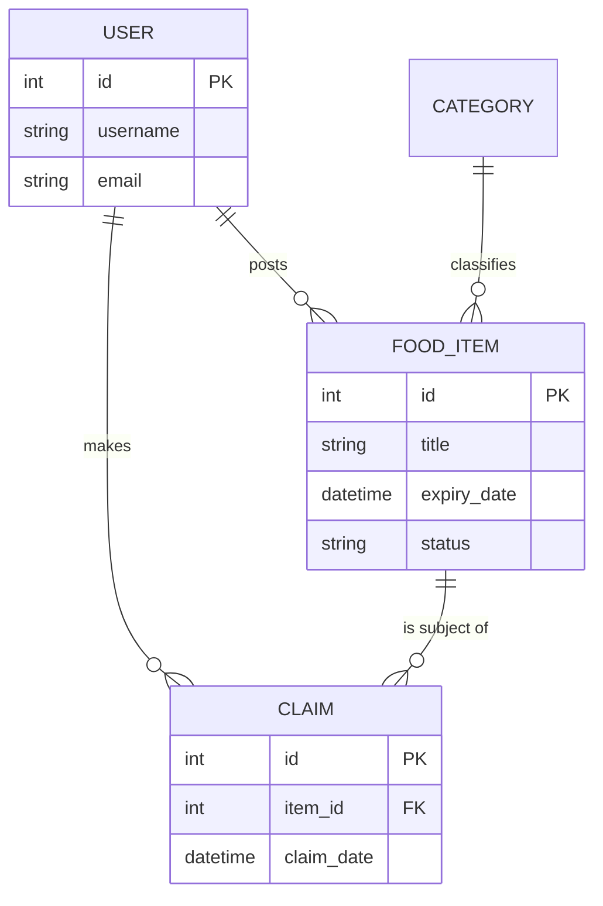

# Sprint 3 Deliverables – FoodShare Green Tech

## 1. Project Information
**Group Name:** FoodShare Green Tech Team
**Project Title:** FoodShare – Community Food Waste Reduction Platform
**GitHub Repository:** [FoodShare-GreenTech](https://github.com/Sameercdytharoo/FoodShare-GreenTech)
**Task Board:** [GitHub Project Board](https://github.com/users/maheshbatala/projects/1)

### Team Members
1. Sameer Chaudhary Tharu (Lead Developer / Scrum Master)
2. Mahesh Batala (Frontend Developer)
3. Dhiraj Yadav (Backend Developer)
4. Prativa Rai (Database Administrator / Tester)
5. Rupesh Shah (DevOps / Documentation Lead)

---

## 2. Implemented User Stories (Sprint 3)

The following core stories from the Sprint 2 plan have been successfully implemented using MySQL, Express, and PUG templates. The development environment runs on Docker.

### US1: Listing Food Items (Donor)
**Story:** As a Donor, I want to list surplus food items with details so that they can be discovered.
> [!IMPORTANT]
> **Action Required:** Insert screenshot of the Add Donation form or the successful listing screen here.
> 

### US2: Browse Available Food (Recipient)
**Story:** As a Recipient, I want to browse available food items so that I can find food near me.
- *Implemented Page:* `/items` (Listing Page) & `/categories` (Tagged by category)
> [!IMPORTANT]
> **Action Required:** Insert screenshot of the `/items` or `/categories` Pug page displaying the database pull.
> 

### US3: View Detailed Items & Claim (Recipient)
**Story:** As a Recipient, I want to see details and claim a food item so that it is no longer available.
- *Implemented Page:* `/items/:id` (Detail Page)
> [!IMPORTANT]
> **Action Required:** Insert screenshot of a single item's detailed `/items/:id` screen.
> 

### US4: Community Directory & Profiles (General)
**Story:** As a User, I want to view a list of community members and their profiles.
- *Implemented Page:* `/users` (Users List Page) & `/users/:id` (User Profile Page)
> [!IMPORTANT]
> **Action Required:** Insert screenshots of the `/users` and `/users/:id` pages.
> 

---

## 3. Database Design

Our application uses a MySQL relational database consisting of the following core tables:

1. **`users`**: Manages our donors, recipients, and partners. 
2. **`categories`**: Tracks food classification (e.g., Bakery, Produce) for filtering purposes.
3. **`food_items`**: The core listing table storing title, description, image, expiration datetime, and status (available/claimed). It links to the `users` and `categories` tables.
4. **`claims`**: Tracks the transaction of claiming food items. 

### Entity Relationship Diagram (Mermaid)

---

## 4. Task Breakdown & Developer Allocation

The team used the GitHub Project board to assign tasks for Sprint 3. The breakdown is as follows:

| Task Description | Assigned Developer | Status |
|:---|:---|:---|
| Backend: Create PUG Templates `/items`, `/users` | Mahesh Batala | Completed |
| Backend: Setup Express routing for new pages | Dhiraj Yadav | Completed |
| Database: Seed database with test categories and items | Prativa Rai | Completed |
| Docker: Verify multi-container orchestration | Rupesh Shah | Completed |
| Integration: Fetch real database data into Views | Sameer Chaudhary Tharu | Completed |

---

## 5. Participation Metrics & Kanban Board

### GitHub Metrics (Contributions)
> [!IMPORTANT]
> **Action Required:** Insert screenshot from your repository's Insights/Contributors page showing commits from all team members.
> 

### Kanban Board Status
> [!IMPORTANT]
> **Action Required:** Insert screenshot of your current Sprint 3 GitHub Project / Kanban board.
> 

---

## 6. Meeting Records

### 📝 Meeting Record: Sprint 3 Kickoff & Allocation
| **Meeting Minutes** | **Details** |
| :--- | :--- |
| **Date and Time** | 10/03/2026 \| 11:00 AM |
| **Meeting Goal** | Plan Sprint 3 deliverables, assign backend integration tasks. |
| **Note taker** | Prativa Rai |
| **Discussion points** | Need to shift from single-page static mocks to server-side PUG templates connecting directly to the MySQL database. Decided to focus on core `item`, `user`, and `category` views first. |
| **Actions** | Create Express routes (Dhiraj), build PUG layouts (Mahesh) |

### 📝 Meeting Record: Sprint 3 Mid-Sprint Review
| **Meeting Minutes** | **Details** |
| :--- | :--- |
| **Date and Time** | 17/03/2026 \| 02:00 PM |
| **Meeting Goal** | Review PUG views and DB queries for correctness. |
| **Note taker** | Rupesh Shah |
| **Discussion points** | Group agreed that using a single `layout.pug` makes styling standard and robust. Docker containers working smoothly for all members. |
| **Actions** | Finalize `/items/:id` claim logic. (Sameer) |

---
**Note to Team:** Remember to replace the placeholder screenshots above before exporting this file to a PDF for Moodle submission!
